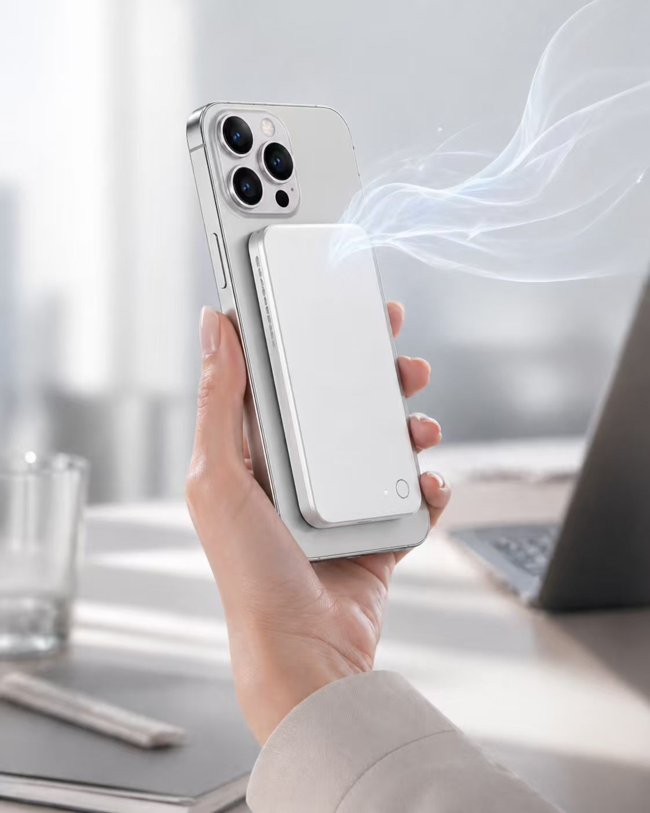
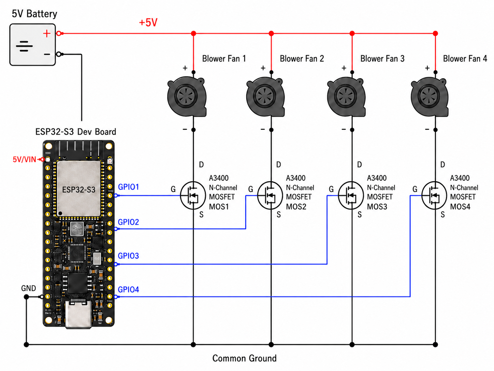

# LingVibe

AttraX Spring Hackathon

<div align="center">
  
</div>

LingVibe is a React + Vite prototype for an AI-guided scent environment. The UI can call either the default OpenAI-compatible LiteLLM provider or the Gemini provider selected from the in-app model dropdown.

## Local Setup

**Prerequisites**

- Node.js 18 or newer
- npm
- Chrome or Edge if you want to use the optional Web Bluetooth fan controller

Install dependencies:

```bash
npm install
```

On Windows PowerShell, if `npm` is blocked by the script execution policy, use the `.cmd` shim instead:

```powershell
npm.cmd install
```

Create a local environment file:

```bash
cp .env.example .env.local
```

On Windows PowerShell:

```powershell
Copy-Item .env.example .env.local
```

## Model Provider Configuration

The app starts with `LiteLLM` selected by default. Configure these values in `.env.local`:

```env
VITE_LITE_LLM_BASE_URL="/api/lite"
LITE_LLM_UPSTREAM_BASE_URL="https://api.minimaxi.com/v1"
LITE_LLM_API_KEY="YOUR_LITELLM_OR_MINIMAX_API_KEY"
VITE_LITE_LLM_MODEL="MiniMax-M2.7"
```

`/api/lite` is a Vite dev-server proxy. It forwards requests to `LITE_LLM_UPSTREAM_BASE_URL` and injects `LITE_LLM_API_KEY` server-side during local development.

To use Gemini instead, get a Gemini API key from Google AI Studio:

https://aistudio.google.com/app/apikey

Then set:

```env
GEMINI_API_KEY="YOUR_GEMINI_API_KEY"
```

Start the app, then choose `Gemini` from the provider dropdown in the top-right status bar.

> Do not commit `.env.local` or real API keys. The current Gemini path is suitable for local demos because the key is read by the browser build. For production, move model calls behind a server-side API so secrets are not exposed to clients.

## Run Locally

Start the Vite dev server:

```bash
npm run dev
```

On Windows PowerShell:

```powershell
npm.cmd run dev
```

Open:

http://localhost:3000/

Use `localhost` for the optional Web Bluetooth fan controller. Web Bluetooth requires Chrome or Edge and a secure context, which includes `localhost` or HTTPS.

## Optional Fan Controller

The UI can connect to a BLE fan controller named `LC_ESP32S3_FAN`.

1. Power on the ESP32 fan controller and make sure it is advertising.
2. Open the app in Chrome or Edge at `http://localhost:3000/`.
3. Click `FAN_OFF` in the top status bar.
4. Select `LC_ESP32S3_FAN` in the browser Bluetooth picker.

The app still works without the fan controller; model responses and visual effects remain available.

## Fan Wiring Principle

<div align="center">
  
</div>

The fan controller uses a 5V battery as the shared power source. The ESP32-S3 `5V/VIN` pin connects to the 5V rail, and the battery negative, ESP32-S3 `GND`, and all MOSFET source pins share the same common ground.

Each blower fan is wired in parallel between the 5V rail and the drain of an A3400 N-channel MOSFET. GPIO1, GPIO2, GPIO3, and GPIO4 drive the MOSFET gates for fan channels 1 through 4. When a GPIO output goes high, the matching MOSFET turns on and completes the fan's path to ground; when the GPIO goes low, that channel turns off.

## Scripts

```bash
npm run dev      # Start local dev server on port 3000
npm run build    # Build production assets into dist/
npm run preview  # Preview the production build
npm run lint     # Type-check with TypeScript
```

## Verification

This setup was verified locally with:

```bash
npm run lint
npm run build
```

The development server should return the app at `http://localhost:3000/`.
